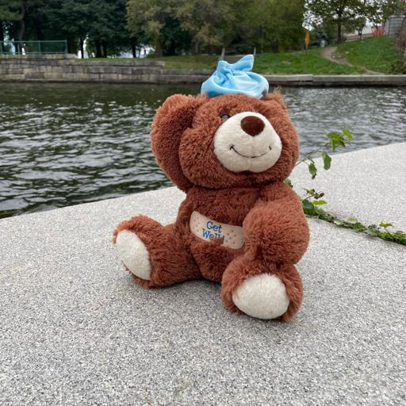
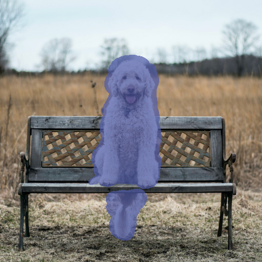
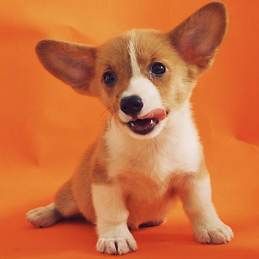
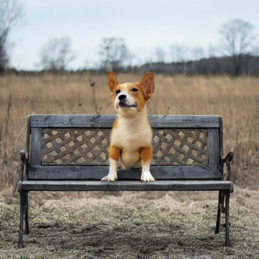
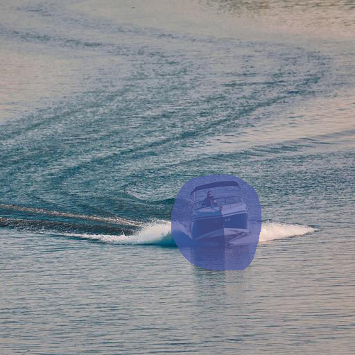
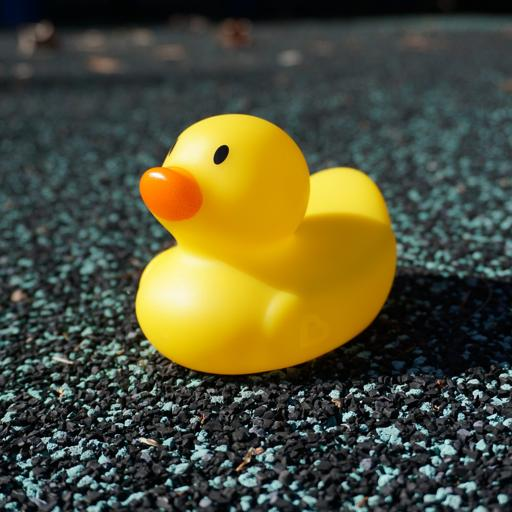

# Context-Aware Image Inpainting

This is the official code repository of paper "Online Data Augmentation and Subject Enhancement for Context-Aware Image Inpainting".


| Source | Subject | Result |
|--------|---------|--------|
|  |  |  |
|  |  |  |
|  |  |  |

## Environment

The code is set up based on the training script of [Dreambooth](https://github.com/huggingface/diffusers/blob/main/examples/dreambooth/train_dreambooth.py), and the pretrained SD Inpainting model is downloaded from [HuggingFace](https://huggingface.co/).

It is recommended to use conda to quickly build an environment.

```
conda env create -f environment.yml
conda activate context-aware
```

## Preliminary Steps

Before running the model, you need to check whether the image data is ready by following the steps below. It is recommended to put the images and scripts used in one experiment into the exp folder to avoid interfering with other codes.
1. Resize Images: Including source, mask and subject images.
2. Dilate mask: If the mask is generated by CLIPSeg, it is usually necessary to dilate it. If the mask is specified by the user, it is usually not necessary.
3. Online Data Augmentation: Run `mask_from_prompt.py` to genearte mask images of subject object and do mask transformation according to actual situation. Then use `merge_by_mask.py` to get the stitched images.
4. Put the pre-trained model under the `/pretrained` directory

## Finetune and Inference
The fine-tuning and inference codes are in one script, so the running process is very simple. You only need to modify the configuration of `run.sh` and then run
```
./run.sh
```

The fine-tuned model and edited result images will be saved in your experiment folder.